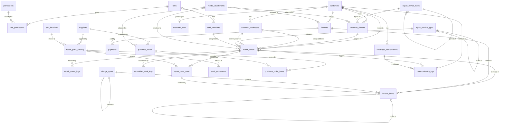

# Database Schema Design — Repair Management System
> **Project:** lab448 / Repair Shop Platform  
> **DB:** PostgreSQL  
> **Version:** 5.0

---

## On Database Schema (Domain) Grouping

PostgreSQL supports logical **schemas** — think of them as named folders inside your database. Instead of all tables in one flat `public` namespace, you can do:

```sql
CREATE SCHEMA iam;         -- roles, permissions, staff_members
CREATE SCHEMA customer;   -- customers, customer_devices, customer_addresses
CREATE SCHEMA repair;     -- repair_orders, repair_status_logs, technician_work_logs
CREATE SCHEMA billing;    -- invoices, invoice_items, payments
CREATE SCHEMA inventory;  -- repair_parts_catalog, suppliers, purchase_orders
CREATE SCHEMA comms;      -- communication_logs, whatsapp_conversations
CREATE SCHEMA system;     -- audit_events, number_sequences
```

Then tables are referenced as `billing.bills`, `inventory.repair_parts_catalog`, etc.

**Recommendation for now:** Stay in `public`. Schema separation adds complexity (cross-schema FK syntax, ORM config, migration tooling). Document the domain grouping in code (model folders, route folders) instead. Add DB schemas in a later phase if you grow into multiple teams or services.

---

## A Note on Types

> **`timestamptz`** is native PostgreSQL — it is the short alias for `TIMESTAMP WITH TIME ZONE`. It is the correct type to use for all date/time columns in PostgreSQL. Always use `timestamptz` over plain `timestamp` to avoid timezone-related bugs.

---

## Naming Conventions

| Rule | Example |
|---|---|
| Tables: **plural, snake_case** | `repair_orders`, `invoice_items` |
| Foreign keys: **role-based** (never a bare `user_id`) | `assigned_to_id`, `received_by_id`, `performed_by_id` |
| Booleans: `is_` / `has_` prefix | `is_active`, `has_warranty` |
| Timestamps: `_at` suffix | `received_at`, `completed_at` |
| Frozen historical prices: `_at_use` suffix | `unit_price_at_use`, `commission_rate_at_use` |
| Status / enum values: `UPPER_SNAKE_CASE` | `IN_PROGRESS`, `BANK_TRANSFER` |
| Domain-prefixed catalog tables: `repair_` prefix | `repair_device_types`, `repair_service_types`, `repair_parts_catalog` |
| No abbreviations, no numbered suffixes (`phone2` → `phone_secondary`) | |

---

## Entity-Relationship Diagram



---

## Domain 1 — IAM (Identity & Access Management)

### `roles`

| Column | Type | Constraints | Purpose |
|---|---|---|---|
| `id` | `varchar` | PK, CUID2 | |
| `code` | `varchar(50)` | UNIQUE, NOT NULL | Machine key: `ADMIN`, `TECHNICIAN`, `RECEPTIONIST` |
| `name` | `varchar(100)` | NOT NULL | Display name: "Repair Army" |
| `description` | `text` | nullable | Notes about this role |
| `is_active` | `boolean` | NOT NULL, default `true` | |
| `created_at` | `timestamptz` | NOT NULL | |
| `updated_at` | `timestamptz` | NOT NULL | |

---

### `permissions`

Every granular capability that can be granted to a role.

| Column | Type | Constraints | Purpose |
|---|---|---|---|
| `id` | `varchar` | PK, CUID2 | |
| `code` | `varchar(100)` | UNIQUE, NOT NULL | Namespaced: `repair:create`, `payment:record`, `inventory:edit` |
| `group` | `varchar(50)` | NOT NULL | UI group: `Repairs`, `Billing`, `Inventory` |
| `description` | `text` | nullable | What this permission allows |
| `created_at` | `timestamptz` | NOT NULL | |

---

### `role_permissions`

Junction — which roles have which permissions.

| Column | Type | Constraints | Purpose |
|---|---|---|---|
| `role_id` | `varchar` | FK → `roles.id`, NOT NULL | |
| `permission_id` | `varchar` | FK → `permissions.id`, NOT NULL | |
| `created_at` | `timestamptz` | NOT NULL | |

> Composite PK: [(role_id, permission_id)](file:///home/aurelius/Documents/lab448-system/backend/src/models/InventoryUsage.js#42-60).

---

### `staff_members`

Every internal person who logs into the system.

| Column | Type | Constraints | Purpose |
|---|---|---|---|
| `id` | `varchar` | PK, CUID2 | |
| `role_id` | `varchar` | FK → `roles.id`, NOT NULL | Access level |
| `name` | `varchar(150)` | NOT NULL | Full display name |
| `email` | `varchar(255)` | UNIQUE, NOT NULL | Login credential |
| `password_hash` | `varchar(255)` | NOT NULL | bcrypt / argon2 |
| `phone` | `varchar(20)` | nullable | Internal contact |
| `is_active` | `boolean` | NOT NULL, default `true` | Deactivated = cannot log in; records stay |
| `commission_rate` | `decimal(5,4)` | nullable | e.g. `0.35` = 35% share. Technicians only. This is the **live** rate; historical rate is frozen per work log. |
| `technician_rank` | `varchar(20)` | nullable, CHECK | `JUNIOR` / `SENIOR` / `EXPERT` / `MASTER` |
| `technician_rank_label` | `varchar(100)` | nullable | Display label: "Repair Sergeant" |
| `last_login_at` | `timestamptz` | nullable | Security hygiene |
| `created_at` | `timestamptz` | NOT NULL | |
| `updated_at` | `timestamptz` | NOT NULL | |

---

## Domain 2 — Customer

### `customers`

| Column | Type | Constraints | Purpose |
|---|---|---|---|
| `id` | `varchar` | PK, CUID2 | |
| `name` | `varchar(200)` | NOT NULL | Full name or business name |
| `phone_primary` | `varchar(20)` | nullable | Main contact |
| `phone_secondary` | `varchar(20)` | nullable | Alternate contact |
| `email` | `varchar(255)` | nullable | For receipts / follow-ups |
| `preferred_channel` | `varchar(20)` | NOT NULL, default `SMS` | How this customer prefers to be contacted: `SMS` / `WHATSAPP` / `EMAIL`. System uses `phone_primary`, then `phone_secondary` as the number for WhatsApp — no separate field needed. |
| `intake_source` | `varchar(30)` | NOT NULL, default `WALK_IN` | How this customer first came to us: `WALK_IN` / `WEBSITE` / `WHATSAPP` / `PHONE` |
| `notes` | `text` | nullable | Internal staff notes ("VIP", "Always bargains") |
| `deleted_at` | `timestamptz` | nullable | Soft-delete: null = active |
| `created_at` | `timestamptz` | NOT NULL | |
| `updated_at` | `timestamptz` | NOT NULL | |

> Physical addresses (including GPS coordinates for delivery/pickup) are stored in `customer_addresses` below — one customer can have multiple saved locations.

---

### `customer_addresses`

Saved locations for a customer. Supports multiple addresses per customer, GPS coordinates, and city/branch resolution for delivery/pickup logistics.

| Column | Type | Constraints | Purpose |
|---|---|---|---|
| `id` | `varchar` | PK, CUID2 | |
| `customer_id` | `varchar` | FK → `customers.id`, NOT NULL | Owner of this address |
| `label` | `varchar(100)` | NOT NULL | e.g., `Home`, `Office`, `Shop` |
| `address_line` | `text` | nullable | Street-level address (house no., road name, landmark) |
| `city_district` | `varchar(150)` | nullable | City or district name: `Kathmandu`, `Lalitpur`, `Bhaktapur` |
| `nearest_branch` | `varchar(150)` | nullable | Nearest shop branch or landmark for logistics routing — e.g., `LAB448 Thamel` or `Near Boudha Stupa`. More levels of resolution (ward, sub-area) can be added later as proper address fields once address standards are defined. |
| `latitude` | `decimal(10,8)` | nullable | GPS latitude — pin dropped by customer on map |
| `longitude` | `decimal(11,8)` | nullable | GPS longitude — pin dropped by customer on map |
| `is_default` | `boolean` | NOT NULL, default `false` | Default address used when creating a delivery order |
| `created_at` | `timestamptz` | NOT NULL | |
| `updated_at` | `timestamptz` | NOT NULL | |

---

### `customer_auth`

Login credentials for the **customer-facing website/portal**. Completely separate from `staff_members` — customers and staff never share a login table.

| Column | Type | Constraints | Purpose |
|---|---|---|---|
| `id` | `varchar` | PK, CUID2 | |
| `customer_id` | `varchar` | FK → `customers.id`, UNIQUE, NOT NULL | One portal account per customer |
| `email` | `varchar(255)` | UNIQUE, NOT NULL | Portal login email |
| `password_hash` | `varchar(255)` | nullable | Null = account created via WhatsApp (no password yet) |
| `is_active` | `boolean` | NOT NULL, default `true` | |
| `email_verified_at` | `timestamptz` | nullable | Null = unverified |
| `verification_token` | `varchar(100)` | nullable | One-time token for email verification or password reset |
| `token_expires_at` | `timestamptz` | nullable | When the token expires |
| `last_login_at` | `timestamptz` | nullable | |
| `created_at` | `timestamptz` | NOT NULL | |
| `updated_at` | `timestamptz` | NOT NULL | |

> A customer who walked in can later register on the portal — staff match them by phone. A WhatsApp user gets an account row with `password_hash = null` until they set a password.

---

### `repair_device_types`

Hierarchical catalogue of device categories (Electronics → Smartphones → Android).

| Column | Type | Constraints | Purpose |
|---|---|---|---|
| `id` | `varchar` | PK, CUID2 | |
| `parent_id` | `varchar` | FK → `repair_device_types.id`, nullable | Self-ref for hierarchy |
| `name` | `varchar(100)` | NOT NULL | e.g., "Smartphones" |
| `sort_order` | `integer` | NOT NULL, default `0` | Manual ordering in dropdowns |
| `is_active` | `boolean` | NOT NULL, default `true` | |
| `created_at` | `timestamptz` | NOT NULL | |
| `updated_at` | `timestamptz` | NOT NULL | |

> `repair_` prefix distinguishes this from any future general-purpose category system.

---

### `customer_devices`

A physical device owned by a customer, brought in for repair.

| Column | Type | Constraints | Purpose |
|---|---|---|---|
| `id` | `varchar` | PK, CUID2 | |
| `customer_id` | `varchar` | FK → `customers.id`, NOT NULL | Owner |
| `device_type_id` | `varchar` | FK → `repair_device_types.id`, nullable | What kind of device |
| `brand` | `varchar(100)` | nullable | Apple, Samsung, Dell |
| `model_name` | `varchar(150)` | nullable | iPhone 15 Pro, Galaxy S24 |
| `color` | `varchar(50)` | nullable | Helps physically identify the device at pickup |
| `serial_number` | `varchar(100)` | nullable | Manufacturer serial or IMEI |
| `purchase_year` | `smallint` | nullable | Rough device age — useful context for technician |
| `has_warranty` | `boolean` | NOT NULL, default `false` | Still under manufacturer warranty? |
| `reported_issue` | `text` | nullable | What the customer says is wrong at intake |
| `created_at` | `timestamptz` | NOT NULL | |
| `updated_at` | `timestamptz` | NOT NULL | |

> **Photos:** Device photos (condition on intake, damage, etc.) are stored in `media_attachments` with `entity_type = 'customer_device'` and `entity_id = <this id>`. See Domain 9.

---

## Domain 3 — Service Catalog

### `repair_service_types`

Hierarchical catalogue of services the shop offers, with base pricing at leaf nodes.

| Column | Type | Constraints | Purpose |
|---|---|---|---|
| `id` | `varchar` | PK, CUID2 | |
| `parent_id` | `varchar` | FK → `repair_service_types.id`, nullable | Self-ref for hierarchy |
| `name` | `varchar(150)` | NOT NULL | e.g., "Screen Replacement" |
| `depth` | `smallint` | NOT NULL | `1`=root, `2`=mid, `3`=leaf |
| `default_service_charge` | `decimal(10,2)` | nullable | Pre-filled charge for this service type at intake. Only set on leaf nodes. |
| `estimated_duration_minutes` | `integer` | nullable | Typical repair time — useful for scheduling and SLA |
| `is_active` | `boolean` | NOT NULL, default `true` | |
| `created_at` | `timestamptz` | NOT NULL | |
| `updated_at` | `timestamptz` | NOT NULL | |

> `default_service_charge` replaces the previous `flat_rate`: "flat rate" is internal jargon. "Default service charge" is what it actually represents — the shop's standard charge for this service type, which can be overridden per repair.

---

## Domain 4 — Repair Workflow

### `repair_orders`

The central operational record for each device submitted for repair, whether it came from a walk-in, the website, or WhatsApp.

| Column | Type | Constraints | Purpose |
|---|---|---|---|
| `id` | `varchar` | PK, CUID2 | |
| `ticket_number` | `varchar(20)` | UNIQUE, NOT NULL | Human-readable ID and QR value: `LAB260222-0001` |
| `customer_id` | `varchar` | FK → `customers.id`, NOT NULL | Who submitted the device |
| `device_id` | `varchar` | FK → `customer_devices.id`, NOT NULL | Which device |
| `assigned_to_id` | `varchar` | FK → `staff_members.id`, nullable | **Currently responsible technician.** Set when status moves to `QUEUED`. See business rule below. |
| `service_type_id` | `varchar` | FK → `repair_service_types.id`, nullable | Type of repair |
| `intake_channel` | `varchar(30)` | NOT NULL, default `WALK_IN` | Where this order originated: `WALK_IN` / `WEBSITE` / `WHATSAPP` / `PHONE` |
| `status` | `varchar(30)` | NOT NULL, CHECK | `PENDING_REVIEW` (online/WA) → `INTAKE` → `QUEUED` → `IN_PROGRESS` → `COMPLETED` → `DELIVERED` / `UNREPAIRABLE` |
| `priority` | `varchar(20)` | NOT NULL, default `NORMAL` | `LOW` / `NORMAL` / `HIGH` / `URGENT` |
| `intake_notes` | `text` | nullable | Notes taken at reception or from the online request |
| `internal_notes` | `text` | nullable | Staff-only notes (not on customer receipt) |
| `diagnosis_notes` | `text` | nullable | What the technician found on inspection |
| `resolution_notes` | `text` | nullable | What was done to fix the device |
| `default_service_charge` | `decimal(10,2)` | NOT NULL, default `0` | Pre-filled from `repair_service_types.default_service_charge` at intake |
| `is_locked` | `boolean` | NOT NULL, default `false` | Locked once invoice is fully paid |
| `has_delivery` | `boolean` | NOT NULL, default `false` | True = device needs pickup/delivery, not walk-in |
| `pickup_address_id` | `varchar` | FK → `customer_addresses.id`, nullable | Where to collect the device from the customer |
| `delivery_address_id` | `varchar` | FK → `customer_addresses.id`, nullable | Where to return the device after repair |
| `pickup_scheduled_at` | `timestamptz` | nullable | When the pickup is arranged |
| `delivery_scheduled_at` | `timestamptz` | nullable | When the delivery is arranged |
| `estimated_completion_at` | `timestamptz` | nullable | Promised ready-date communicated to customer |
| `intake_at` | `timestamptz` | nullable | When the device was physically received (null for online orders awaiting pickup) |
| `queued_at` | `timestamptz` | nullable | When moved to repair queue |
| `in_progress_at` | `timestamptz` | nullable | When technician started work |
| `completed_at` | `timestamptz` | nullable | When repair was marked done |
| `delivered_at` | `timestamptz` | nullable | When device was returned to customer |
| `created_at` | `timestamptz` | NOT NULL | |
| `updated_at` | `timestamptz` | NOT NULL | |

> **Online / WhatsApp orders:** When a customer submits a repair request via the website or WhatsApp, a `repair_order` is created with `status = PENDING_REVIEW` and `intake_at = null`. Staff review and confirm it, setting `status = INTAKE` and scheduling a pickup if `has_delivery = true`.

> **Technician assignment business rule:**  
> When a technician moves a repair to `QUEUED`, `assigned_to_id` is set to that technician. Only `ADMIN` and `RECEPTIONIST` roles can reassign. Commission history tracked in `technician_work_logs`.

---

### `repair_status_logs`

Immutable history of every status transition on a repair order.

| Column | Type | Constraints | Purpose |
|---|---|---|---|
| `id` | `varchar` | PK, CUID2 | |
| `repair_order_id` | `varchar` | FK → `repair_orders.id`, NOT NULL | |
| `from_status` | `varchar(30)` | nullable | Previous status (null on first entry) |
| `to_status` | `varchar(30)` | NOT NULL | New status |
| `changed_by_id` | `varchar` | FK → `staff_members.id`, NOT NULL | Who made the change |
| `notes` | `text` | nullable | Reason for change |
| `created_at` | `timestamptz` | NOT NULL | |

---

### `technician_work_logs`

Records every work session by a technician on a repair order. This is the source of truth for **pay calculation**, not `assigned_to_id`.

| Column | Type | Constraints | Purpose |
|---|---|---|---|
| `id` | `varchar` | PK, CUID2 | |
| `repair_order_id` | `varchar` | FK → `repair_orders.id`, NOT NULL | Which repair |
| `technician_id` | `varchar` | FK → `staff_members.id`, NOT NULL | Who did the work |
| `started_at` | `timestamptz` | NOT NULL | When this work session began |
| `ended_at` | `timestamptz` | nullable | When it ended (null = still active) |
| `duration_minutes` | `integer` | nullable | Duration of session (computed or manual) |
| `work_description` | `text` | nullable | What was done in this session |
| `commission_rate_at_use` | `decimal(5,4)` | NOT NULL | Technician's commission rate frozen at session start. Changing the technician's rate later won't affect past sessions. |
| `commission_amount` | `decimal(10,2)` | nullable | Calculated pay for this session |
| `is_approved` | `boolean` | NOT NULL, default `false` | Manager must approve before payout |
| `approved_by_id` | `varchar` | FK → `staff_members.id`, nullable | Manager who approved |
| `created_at` | `timestamptz` | NOT NULL | |
| `updated_at` | `timestamptz` | NOT NULL | |

> `commission_rate_at_use` replaces `commission_rate_snapshot` — the `_at_use` suffix is consistent with the project-wide convention for historical values (same as `unit_price_at_use` in parts).

---

## Domain 5 — Invoicing

> **How invoices and repairs connect:** An `invoice` belongs to a **customer** and can cover **one or many repair orders**. This means the front desk can raise a single printed invoice that includes all repairs a customer brought in during a visit — no separate receipts per device. Each `invoice_item` line knows which `repair_order` it belongs to, so the breakdown is always available.

### `invoices`

The printable invoice handed to the customer. Links to the customer, not a single repair order. **This is the single place where discount and tax are calculated** — not per line item.

| Column | Type | Constraints | Purpose |
|---|---|---|---|
| `id` | `varchar` | PK, CUID2 | |
| `invoice_number` | `varchar(30)` | UNIQUE, NOT NULL | Human-readable: `INV-260222-0001` (via `ref_counters`) |
| `customer_id` | `varchar` | FK → `customers.id`, NOT NULL | Who this invoice is for |
| `status` | `varchar(20)` | NOT NULL, default `DRAFT` | `DRAFT` → `ISSUED` → `PARTIAL` → `PAID` / `CANCELLED` |
| `subtotal_amount` | `decimal(10,2)` | NOT NULL, default `0` | Sum of all `invoice_items.amount` |
| `discount_amount` | `decimal(10,2)` | NOT NULL, default `0` | Discount applied to the whole invoice |
| `discount_reason` | `varchar(100)` | nullable | Why the discount was given: `PROMO`, `WARRANTY`, `GOODWILL`, or plain note |
| `tax_rate` | `decimal(5,4)` | NOT NULL, default `0` | e.g. `0.13` = 13% VAT. Applied once to the whole invoice. |
| `tax_amount` | `decimal(10,2)` | NOT NULL, default `0` | [(subtotal − discount) × tax_rate](file:///home/aurelius/Documents/lab448-system/backend/src/models/InventoryUsage.js#42-60) |
| `total_amount` | `decimal(10,2)` | NOT NULL, default `0` | Final payable: `subtotal − discount + tax` |
| `total_paid_amount` | `decimal(10,2)` | NOT NULL, default `0` | Sum of all payments received |
| `staff_commission_amount` | `decimal(10,2)` | NOT NULL, default `0` | Total technician commission on this invoice |
| `shop_revenue_amount` | `decimal(10,2)` | NOT NULL, default `0` | Net shop revenue after commission |
| `notes` | `text` | nullable | Bill-level memo visible to customer |
| `issued_at` | `timestamptz` | nullable | When invoice was presented to customer |
| `due_at` | `timestamptz` | nullable | Payment deadline |
| `is_locked` | `boolean` | NOT NULL, default `false` | Locked when fully paid |
| `created_by_id` | `varchar` | FK → `staff_members.id`, NOT NULL | Who created the invoice |
| `created_at` | `timestamptz` | NOT NULL | |
| `updated_at` | `timestamptz` | NOT NULL | |

> **Why `invoices` + `invoice_items` are separate:** `invoices` is the document header — it has the invoice number, total, status, and is what gets printed. `invoice_items` are the individual line rows on that document. This is standard double-entry / accounting structure: one document header, many document lines. There is no redundancy — the header exists so you have one `invoice_number`, one `status`, and one `total` without repeating it on every line.

> **Multiple repairs, one bill:** Simply add `invoice_items` from multiple `repair_orders` to the same `bill`. The breakdown per repair is preserved in `invoice_items.repair_order_id`. One customer visit → one invoice → line items from each of their devices.

---

### `charge_types`

Lookup table for what kind of charge an invoice line is. Hierarchical — no magic strings.

| Column | Type | Constraints | Purpose |
|---|---|---|---|
| `id` | `varchar` | PK, CUID2 | |
| `parent_id` | `varchar` | FK → `charge_types.id`, nullable | Hierarchy: `LABOUR` → `DIAGNOSTIC`, `ASSEMBLY` |
| `code` | `varchar(50)` | UNIQUE, NOT NULL | `SERVICE_FEE` / `PARTS` / `LABOUR` / `DISCOUNT` / `VAT` / `OTHER` |
| `name` | `varchar(100)` | NOT NULL | Display name |
| `is_discount` | `boolean` | NOT NULL, default `false` | True = reduces the invoice total |
| `is_tax` | `boolean` | NOT NULL, default `false` | Reserved for future line-level tax if needed (VAT exemptions, multi-rate) |
| `sort_order` | `integer` | NOT NULL, default `0` | UI display order |
| `is_active` | `boolean` | NOT NULL, default `true` | |
| `created_at` | `timestamptz` | NOT NULL | |
| `updated_at` | `timestamptz` | NOT NULL | |

---

### `invoice_items`

Every line on an invoice — services, parts, labour. **No tax or discount fields here** — those live on `invoices` and are calculated once at the invoice level.

| Column | Type | Constraints | Purpose |
|---|---|---|---|
| `id` | `varchar` | PK, CUID2 | |
| `invoice_id` | `varchar` | FK → `invoices.id`, NOT NULL | Which invoice |
| `repair_order_id` | `varchar` | FK → `repair_orders.id`, nullable | Which repair this line is for (null = invoice-level line) |
| `parent_item_id` | `varchar` | FK → `invoice_items.id`, nullable | Group child lines under a header (e.g. "Labour" → detail rows) |
| `charge_type_id` | `varchar` | FK → `charge_types.id`, NOT NULL | What kind of charge |
| `description` | `varchar(255)` | NOT NULL | What the customer sees on the printed invoice |
| `quantity` | `decimal(10,3)` | NOT NULL, default `1` | Supports fractional units (0.5 meters of cable) |
| `unit_price` | `decimal(10,2)` | NOT NULL, default `0` | Price per unit |
| `amount` | `decimal(10,2)` | NOT NULL | `quantity × unit_price` |
| `source_part_usage_id` | `varchar` | FK → `repair_parts_used.id`, nullable | Links to the part usage record when `charge_type = PARTS`. **One line per part** — if 3 different parts were used, there are 3 separate `invoice_items` rows, each with its own `source_part_usage_id`. |
| `added_by_id` | `varchar` | FK → `staff_members.id`, NOT NULL | Who added this line |
| `created_at` | `timestamptz` | NOT NULL | |

**Calculation flow (no redundancy):**
```
invoice_items → each has quantity × unit_price = amount
invoices.subtotal_amount = SUM(invoice_items.amount)
invoices.tax_amount      = (subtotal − discount) × tax_rate      ← computed once
invoices.total_amount    = subtotal − discount_amount + tax_amount  ← single truth
```

---

### `payments`

Money received against an invoice.

| Column | Type | Constraints | Purpose |
|---|---|---|---|
| `id` | `varchar` | PK, CUID2 | |
| `invoice_id` | `varchar` | FK → `invoices.id`, NOT NULL | Which invoice this payment is against |
| `amount` | `decimal(10,2)` | NOT NULL | Amount received |
| `payment_method` | `varchar(30)` | NOT NULL, CHECK | `CASH` / `CARD` / `BANK_TRANSFER` / `DIGITAL_WALLET` / `CHEQUE` / `OTHER` |
| `reference_number` | `varchar(100)` | nullable | Bank txn ref, eSewa/Khalti code, cheque number |
| `received_by_id` | `varchar` | FK → `staff_members.id`, NOT NULL | Who collected the money |
| `payment_note` | `text` | nullable | e.g., "Partial — balance on delivery" |
| `received_at` | `timestamptz` | NOT NULL | When money was received |
| `created_at` | `timestamptz` | NOT NULL | |

---

## Domain 6 — Inventory

### `suppliers`

| Column | Type | Constraints | Purpose |
|---|---|---|---|
| `id` | `varchar` | PK, CUID2 | |
| `name` | `varchar(200)` | NOT NULL | Supplier business name |
| `contact_name` | `varchar(150)` | nullable | Primary contact person |
| `phone` | `varchar(20)` | nullable | |
| `email` | `varchar(255)` | nullable | |
| `address` | `text` | nullable | |
| `notes` | `text` | nullable | |
| `is_active` | `boolean` | NOT NULL, default `true` | |
| `created_at` | `timestamptz` | NOT NULL | |
| `updated_at` | `timestamptz` | NOT NULL | |

---

### `part_locations`

Physical storage locations (shelf, bin, room).

| Column | Type | Constraints | Purpose |
|---|---|---|---|
| `id` | `varchar` | PK, CUID2 | |
| `code` | `varchar(50)` | UNIQUE, NOT NULL | e.g., `SHELF-A1`, `BIN-03` |
| `name` | `varchar(100)` | NOT NULL | Human description |
| `created_at` | `timestamptz` | NOT NULL | |
| `updated_at` | `timestamptz` | NOT NULL | |

---

### `repair_parts_catalog`

Master list of all spare parts and materials the shop stocks.

| Column | Type | Constraints | Purpose |
|---|---|---|---|
| `id` | `varchar` | PK, CUID2 | |
| `sku` | `varchar(100)` | UNIQUE, nullable | Stock-keeping unit |
| `name` | `varchar(200)` | NOT NULL | Part name |
| `description` | `text` | nullable | Specs / extended info |
| `category` | `varchar(100)` | nullable | "Screen", "Battery", "Charging Port" |
| `unit` | `varchar(20)` | NOT NULL, default `pcs` | `pcs`, `meters`, `liters`, etc. |
| `available_quantity` | `integer` | NOT NULL, default `0` | Current stock on hand |
| `reorder_threshold` | `integer` | nullable | Alert when stock hits this level |
| `reorder_quantity` | `integer` | nullable | Suggested restocking quantity |
| `unit_cost_price` | `decimal(10,2)` | nullable | What the shop pays per unit (COGS) |
| `unit_sell_price` | `decimal(10,2)` | NOT NULL, default `0` | Default price charged to customer |
| `location_id` | `varchar` | FK → `part_locations.id`, nullable | Where this part is stored |
| `supplier_id` | `varchar` | FK → `suppliers.id`, nullable | Primary supplier |
| `is_active` | `boolean` | NOT NULL, default `true` | |
| `created_at` | `timestamptz` | NOT NULL | |
| `updated_at` | `timestamptz` | NOT NULL | |

---

### `repair_parts_used`

Which parts were consumed on a repair, with price frozen at the time of use.

| Column | Type | Constraints | Purpose |
|---|---|---|---|
| `id` | `varchar` | PK, CUID2 | |
| `repair_order_id` | `varchar` | FK → `repair_orders.id`, NOT NULL | Which repair |
| `part_id` | `varchar` | FK → `repair_parts_catalog.id`, NOT NULL | Which part |
| `quantity` | `decimal(10,3)` | NOT NULL | How much used |
| `unit_price_at_use` | `decimal(10,2)` | NOT NULL | Sell price at the time this part was used. Frozen so historical billing stays accurate even if catalog price changes later. |
| `unit_cost_at_use` | `decimal(10,2)` | nullable | Cost price at time of use — for COGS / margin reporting |
| `recorded_by_id` | `varchar` | FK → `staff_members.id`, NOT NULL | Who logged this usage |
| `notes` | `text` | nullable | Why this part was used |
| `created_at` | `timestamptz` | NOT NULL | |

> Each row is one part-type used in one session. Multiple sessions using the same part = multiple rows. Each row links to exactly one `invoice_items` row via `source_part_usage_id`.

---

### `stock_movements`

Append-only log of every change to `repair_parts_catalog.available_quantity`.

| Column | Type | Constraints | Purpose |
|---|---|---|---|
| `id` | `varchar` | PK, CUID2 | |
| `part_id` | `varchar` | FK → `repair_parts_catalog.id`, NOT NULL | |
| `movement_type` | `varchar(30)` | NOT NULL, CHECK | `PURCHASE_IN` / `REPAIR_USED` / `RETURN` / `ADJUSTMENT` / `WRITE_OFF` |
| `quantity_change` | `integer` | NOT NULL | Positive = stock added, negative = removed |
| `quantity_after` | `integer` | NOT NULL | Stock level after this movement (snapshot) |
| `reference_id` | `varchar` | nullable | Related record ID (repair order, purchase order) |
| `reference_type` | `varchar(50)` | nullable | `repair_order` / `purchase_order` |
| `notes` | `text` | nullable | Reason for manual adjustment |
| `recorded_by_id` | `varchar` | FK → `staff_members.id`, NOT NULL | |
| `created_at` | `timestamptz` | NOT NULL | |

---

### `purchase_orders`

When the shop orders parts from a supplier to restock inventory.

| Column | Type | Constraints | Purpose |
|---|---|---|---|
| `id` | `varchar` | PK, CUID2 | |
| `po_number` | `varchar(30)` | UNIQUE, NOT NULL | Human-readable PO number: `PO-260222-0001` (via `ref_counters`) |
| `supplier_id` | `varchar` | FK → `suppliers.id`, NOT NULL | Who it was ordered from |
| `status` | `varchar(20)` | NOT NULL, default `DRAFT` | `DRAFT` → `ORDERED` → `PARTIALLY_RECEIVED` → `RECEIVED` / `CANCELLED` |
| `ordered_at` | `timestamptz` | nullable | When the order was placed |
| `expected_at` | `timestamptz` | nullable | Expected delivery date |
| `received_at` | `timestamptz` | nullable | When stock was fully received |
| `notes` | `text` | nullable | |
| `total_amount` | `decimal(10,2)` | NOT NULL, default `0` | Total cost of this order |
| `created_by_id` | `varchar` | FK → `staff_members.id`, NOT NULL | Who raised the PO |
| `created_at` | `timestamptz` | NOT NULL | |
| `updated_at` | `timestamptz` | NOT NULL | |

---

### `purchase_order_items`

Line items on a purchase order.

| Column | Type | Constraints | Purpose |
|---|---|---|---|
| `id` | `varchar` | PK, CUID2 | |
| `purchase_order_id` | `varchar` | FK → `purchase_orders.id`, NOT NULL | Parent PO |
| `part_id` | `varchar` | FK → `repair_parts_catalog.id`, NOT NULL | Which part is being ordered |
| `quantity_ordered` | `integer` | NOT NULL | How many ordered |
| `quantity_received` | `integer` | NOT NULL, default `0` | How many arrived (for partial deliveries) |
| `unit_cost` | `decimal(10,2)` | NOT NULL | Cost per unit from supplier |
| `amount` | `decimal(10,2)` | NOT NULL | `quantity_ordered × unit_cost` |
| `created_at` | `timestamptz` | NOT NULL | |

---

## Domain 7 — Media Attachments

### `media_attachments`

A central table for any file or photo linked to any entity in the system. One table handles photos for devices, invoices, purchase orders, repair orders — no need to add URL columns to every table.

| Column | Type | Constraints | Purpose |
|---|---|---|---|
| `id` | `varchar` | PK, CUID2 | |
| `entity_type` | `varchar(50)` | NOT NULL | Which table the file belongs to: `customer_device`, `repair_order`, `invoice`, `purchase_order` |
| `entity_id` | `varchar` | NOT NULL | The PK of the linked record |
| `file_name` | `varchar(255)` | NOT NULL | Original filename |
| `file_url` | `text` | NOT NULL | Stored URL (S3, local path, etc.) |
| `file_type` | `varchar(20)` | nullable | `image/jpeg`, `image/png`, `application/pdf` |
| `file_size_bytes` | `integer` | nullable | For storage tracking |
| `label` | `varchar(100)` | nullable | e.g., "Before repair", "Bill scan", "Delivery receipt" |
| `uploaded_by_id` | `varchar` | FK → `staff_members.id`, NOT NULL | Who uploaded it |
| `created_at` | `timestamptz` | NOT NULL | |

> **How to use:** To get all photos for a device, query `WHERE entity_type = 'customer_device' AND entity_id = '<device_id>'`. No changes to any other table needed when you add a new attachable entity — just use the new entity_type string.

---

## Domain 8 — Communications

> Covers all outbound notifications (SMS, WhatsApp, Email), inbound customer messages, and the message templates that drive them.

### `message_templates`

Editable templates for all outbound messages (SMS, WhatsApp, Email). Storing templates here means you can update message wording without touching code or redeploying.

| Column | Type | Constraints | Purpose |
|---|---|---|---|
| `id` | `varchar` | PK, CUID2 | |
| `channel` | `varchar(20)` | NOT NULL, CHECK | `SMS` / `WHATSAPP` / `EMAIL` |
| `event_type` | `varchar(50)` | NOT NULL | The trigger event this template handles: `REPAIR_INTAKE` / `REPAIR_COMPLETED` / `PAYMENT_RECEIVED` / `ORDER_CONFIRMED` |
| `language` | `varchar(10)` | NOT NULL, default `en` | Language code: `en`, `ne` (Nepali). Allows multi-language templates per event. |
| `subject` | `varchar(255)` | nullable | Email subject line. Null for SMS/WhatsApp. |
| `body` | `text` | NOT NULL | Message body. Use `{{customer_name}}`, `{{ticket_number}}`, `{{shop_name}}` as placeholders — resolved at send time in code. |
| `is_active` | `boolean` | NOT NULL, default `true` | Only active templates are used for sending |
| `created_at` | `timestamptz` | NOT NULL | |
| `updated_at` | `timestamptz` | NOT NULL | |

> **How it works:** Code looks up the template by [(channel, event_type, language)](file:///home/aurelius/Documents/lab448-system/backend/src/models/InventoryUsage.js#42-60), fills in the `{{placeholders}}`, and sends. No hard-coded message strings in the codebase. A unique constraint on [(channel, event_type, language, is_active)](file:///home/aurelius/Documents/lab448-system/backend/src/models/InventoryUsage.js#42-60) ensures one active template per combination.

---

### `whatsapp_conversations`

Tracks the state of a WhatsApp conversation thread with a customer. WhatsApp Business API works on conversation sessions — this table manages that state.

| Column | Type | Constraints | Purpose |
|---|---|---|---|
| `id` | `varchar` | PK, CUID2 | |
| `customer_id` | `varchar` | FK → `customers.id`, nullable | Resolved customer (null until matched by phone number) |
| `wa_phone_number` | `varchar(20)` | NOT NULL | The customer's WhatsApp number (e.g., `+9779800000000`) |
| `wa_contact_name` | `varchar(150)` | nullable | Display name from WhatsApp at time of first message |
| `status` | `varchar(20)` | NOT NULL, default `OPEN` | `OPEN` / `PENDING_STAFF` / `RESOLVED` / `BOT_HANDLING` |
| `last_message_at` | `timestamptz` | nullable | When the last message was received or sent |
| `assigned_to_id` | `varchar` | FK → `staff_members.id`, nullable | Which staff member is handling this conversation |
| `linked_repair_order_id` | `varchar` | FK → `repair_orders.id`, nullable | If this conversation led to or is about a repair order |
| `created_at` | `timestamptz` | NOT NULL | |
| `updated_at` | `timestamptz` | NOT NULL | |

---

### `communication_logs`

Every message — inbound or outbound — across all channels: SMS, WhatsApp, Email. Replaces the old `notification_logs` name to reflect that it now handles two-way communication.

| Column | Type | Constraints | Purpose |
|---|---|---|---|
| `id` | `varchar` | PK, CUID2 | |
| `customer_id` | `varchar` | FK → `customers.id`, nullable | Who the message is to/from |
| `repair_order_id` | `varchar` | FK → `repair_orders.id`, nullable | Related repair, if any |
| `whatsapp_conversation_id` | `varchar` | FK → `whatsapp_conversations.id`, nullable | The WhatsApp thread this message belongs to |
| `channel` | `varchar(20)` | NOT NULL, CHECK | `SMS` / `WHATSAPP` / `EMAIL` / `PUSH` |
| `direction` | `varchar(10)` | NOT NULL, CHECK | `OUTBOUND` (system → customer) / `INBOUND` (customer → system) |
| `event_type` | `varchar(50)` | nullable | For outbound system messages: `REPAIR_INTAKE` / `REPAIR_COMPLETED` / `PAYMENT_RECEIVED` / `ORDER_CONFIRMED`. Null for freeform inbound. |
| `recipient_or_sender` | `varchar(255)` | NOT NULL | Phone/email/WA number of the other party |
| `message_body` | `text` | NOT NULL | Full message content |
| `status` | `varchar(20)` | NOT NULL, default `SENT` | Outbound: `SENT` / `DELIVERED` / `FAILED`. Inbound: `RECEIVED` / `READ`. |
| `provider_message_id` | `varchar(100)` | nullable | Message ID from WhatsApp/SMS provider — used for delivery receipts and deduplication |
| `provider_response` | `jsonb` | nullable | Full raw API response from provider |
| `sent_or_received_at` | `timestamptz` | NOT NULL | When the message was sent (outbound) or received (inbound) |
| `created_at` | `timestamptz` | NOT NULL | |

---

## Domain 9 — System

### `ref_counters`

**Why this table exists:** When two people create a repair ticket at the same exact second, you need to guarantee they get different numbers (e.g., `0042` and `0043`) without ever duplicating. Doing this in application code is risky under simultaneous load — the database handles it with a row-level lock on this single row per counter type, guaranteeing each number is issued exactly once.

One row per document type. Keep it that simple.

| Column | Type | Constraints | Purpose |
|---|---|---|---|
| `counter_type` | `varchar(50)` | PK | One row per type: `TICKET`, `INVOICE`, `PURCHASE_ORDER`. Adding a new document that needs a readable number = adding one row here. |
| `prefix` | `varchar(10)` | NOT NULL | Number prefix: `LAB`, `INV`, `PO` |
| `last_value` | `integer` | NOT NULL, default `0` | Last issued number. Increment this atomically, use the new value. |
| `pad_length` | `smallint` | NOT NULL, default `4` | How many digits to zero-pad: `4` → `0001`, `0042` |
| `updated_at` | `timestamptz` | NOT NULL | Last time a number was issued from this counter |

> **Date in the ticket number?** The date (`260222`) is formatted in code at the time of issue and prepended to the counter value. Example: `LAB` + `260222` + `0042` → `LAB260222-0042`. This way the counter itself stays clean (just an integer), and the date format in the ticket can be changed any time without touching this table.

---

### `audit_events`

Append-only log of significant actions in the system.

| Column | Type | Constraints | Purpose |
|---|---|---|---|
| `id` | `varchar` | PK, CUID2 | |
| `performed_by_id` | `varchar` | FK → `staff_members.id`, nullable | Who did it. Null = system/automated action |
| `actor_type` | `varchar(20)` | NOT NULL, default `STAFF` | `STAFF` / `SYSTEM` / `API` |
| `event_name` | `varchar(100)` | NOT NULL | Namespaced: `repair_order.status_changed`, `payment.recorded` |
| `entity_type` | `varchar(50)` | NOT NULL | Affected model: `repair_order`, `invoice`, `payment` |
| `entity_id` | `varchar` | NOT NULL | PK of the affected record |
| `repair_order_id` | `varchar` | FK → `repair_orders.id`, nullable | Fast FK for filtering by repair |
| `before_snapshot` | `jsonb` | nullable | Record state before change |
| `after_snapshot` | `jsonb` | nullable | Record state after change |
| `ip_address` | `varchar(45)` | nullable | For security auditing |
| `created_at` | `timestamptz` | NOT NULL | |

---

## Complete Table List

| # | Domain | Table | From (old name) |
|---|---|---|---|
| 1 | IAM | `roles` | same |
| 2 | IAM | `permissions` | **NEW** |
| 3 | IAM | `role_permissions` | **NEW** |
| 4 | IAM | `staff_members` | `users` |
| 5 | Customer | `customers` | same |
| 6 | Customer | `customer_addresses` | **NEW** |
| 7 | Customer | `customer_auth` | **NEW** |
| 8 | Customer | `repair_device_types` | `device_categories` |
| 9 | Customer | `customer_devices` | `devices` |
| 10 | Catalog | `repair_service_types` | `repair_categories` |
| 11 | Repair | `repair_orders` | `repairs` |
| 12 | Repair | `repair_status_logs` | **NEW** |
| 13 | Repair | `technician_work_logs` | **NEW** |
| 14 | Invoicing | `invoices` | `bills` |
| 15 | Invoicing | `charge_types` | **NEW** |
| 16 | Invoicing | `invoice_items` | `bill_items` / `repair_charges` |
| 17 | Invoicing | `payments` | same |
| 18 | Inventory | `suppliers` | **NEW** |
| 19 | Inventory | `part_locations` | **NEW** |
| 20 | Inventory | `repair_parts_catalog` | `inventories` |
| 21 | Inventory | `repair_parts_used` | `inventory_usages` |
| 22 | Inventory | `stock_movements` | **NEW** |
| 23 | Inventory | `purchase_orders` | **NEW** |
| 24 | Inventory | `purchase_order_items` | **NEW** |
| 25 | Media | `media_attachments` | **NEW** |
| 26 | Comms | `whatsapp_conversations` | **NEW** |
| 27 | Comms | `communication_logs` | `notification_logs` |
| 28 | System | `ref_counters` | `qr_daily_sequences` |
| 29 | System | `audit_events` | `audit_logs` |

---

## What Indexes Are (Plain Language)

Imagine a 50,000-row table of repair orders. When you search for all repairs with `status = 'IN_PROGRESS'`, without an index the database reads **every single row** to check the status column. With an index on `status`, it jumps directly to the matching rows — like using the index at the back of a book instead of reading every page.

**When you need one:** Any column you regularly search/filter by, join on, or sort by. Foreign keys especially.

**When you don't:** Columns you almost never filter by, or tiny tables (< a few hundred rows) where a full scan is fast anyway.

PostgreSQL creates indexes automatically on primary keys and unique columns. The ones below are the additional ones you need to create manually:

```sql
-- Repair lookup (most common queries in the app)
CREATE INDEX ON repair_orders (status);
CREATE INDEX ON repair_orders (customer_id);
CREATE INDEX ON repair_orders (assigned_to_id);
CREATE INDEX ON repair_orders (ticket_number);

-- Invoicing
CREATE INDEX ON invoices (customer_id, status);
CREATE INDEX ON invoice_items (invoice_id, repair_order_id);

-- Inventory
CREATE INDEX ON repair_parts_catalog (sku);
CREATE INDEX ON stock_movements (part_id, created_at);

-- Audit (filtered by entity or by repair)
CREATE INDEX ON audit_events (entity_type, entity_id);
CREATE INDEX ON audit_events (repair_order_id);

-- Media (to find all files for a device/invoice/etc.)
CREATE INDEX ON media_attachments (entity_type, entity_id);

-- Communications
CREATE INDEX ON communication_logs (customer_id, channel);
CREATE INDEX ON whatsapp_conversations (wa_phone_number);
```
